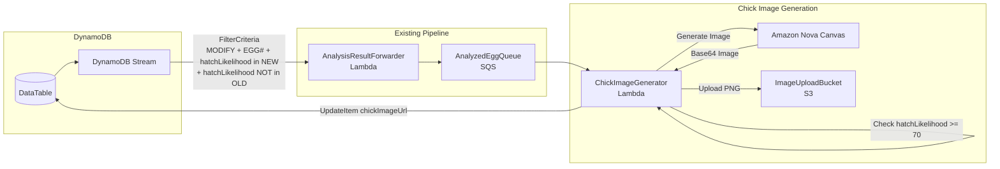

# Design Document: Chick Image Generation

## Overview

The Chick Image Generator extends the egg analysis pipeline to create photorealistic images of predicted chicks using Amazon Nova Canvas. When an egg record is updated with analysis results showing high hatch likelihood (>= 70%), the system generates an image based on the predicted breed and appearance characteristics, stores it in S3, and updates the DynamoDB record with the image location.

The architecture leverages the existing `AnalyzedEggQueue` and `AnalysisResultForwarder` infrastructure, adding a new Lambda function that:
- Filters for high-likelihood eggs
- Generates chick images via Nova Canvas
- Stores images in S3
- Updates DynamoDB with image URLs

## Architecture



**Key Filter Logic:** The AnalysisResultForwarder filter must ensure hatchLikelihood exists in NewImage but NOT in OldImage. This prevents re-triggering when we update the record with chickImageUrl.

## Components and Interfaces

### 1. AnalyzedEggQueue (Existing)

The existing SQS queue that receives analyzed egg records from the AnalysisResultForwarder.

**Message Format:**
```json
{
  "pk": "BATCH#2024-01-15",
  "sk": "EGG#egg-001",
  "hatchLikelihood": 85,
  "predictedChickBreed": "Rhode Island Red",
  "chickenAppearance": {
    "plumageColor": "red-brown",
    "combType": "single",
    "bodyType": "large/heavy",
    "featherPattern": "solid",
    "legColor": "yellow"
  },
  ...
}
```

### 2. ChickImageGenerator (Lambda)

Node.js Lambda function that processes analyzed eggs and generates chick images.

**Interface:**
```typescript
interface EggRecord {
  pk: string;
  sk: string;  // "EGG#{eggId}"
  hatchLikelihood: number;
  predictedChickBreed: string;
  chickenAppearance: ChickenAppearance;
  // ... other egg fields
}

interface ChickenAppearance {
  plumageColor: string;
  combType: string;
  bodyType: string;
  featherPattern: string;
  legColor: string;
}

interface ImageGenerationResult {
  success: boolean;
  s3Key?: string;
  s3Uri?: string;
  error?: string;
}
```

**Configuration:**
- Runtime: nodejs22.x
- Timeout: 60 seconds (image generation can take time)
- Memory: 1024 MB (for image processing)

### 3. Nova Canvas Integration

Uses Amazon Nova Canvas (amazon.nova-canvas-v1:0) for image generation.

**Prompt Construction:**
```
A photorealistic image of a cute baby chick, {predictedChickBreed} breed.
The chick has {plumageColor} downy feathers, a small {combType} comb beginning to form,
{bodyType} body proportions, {featherPattern} feather pattern emerging, and {legColor} legs.
The chick is standing on clean straw in a warm brooder with soft lighting.
Professional poultry photography style, high detail, adorable expression.
```

**API Request:**
```javascript
{
  modelId: 'amazon.nova-canvas-v1:0',
  contentType: 'application/json',
  accept: 'application/json',
  body: JSON.stringify({
    taskType: 'TEXT_IMAGE',
    textToImageParams: {
      text: prompt
    },
    imageGenerationConfig: {
      numberOfImages: 1,
      width: 1024,
      height: 1024,
      quality: 'standard'
    }
  })
}
```

### 4. S3 Storage

Uses the existing ImageUploadBucket for storing generated chick images.

**Key Format:** `chicks/{pk}/{eggId}.png`
- Example: `chicks/BATCH#2024-01-15/egg-001.png`

**S3 URI Format:** `s3://{bucket}/chicks/{pk}/{eggId}.png`

### 5. DynamoDB Update

Updates the original egg record with image information.

**Update Expression:**
```javascript
{
  TableName: TABLE_NAME,
  Key: { pk, sk },
  UpdateExpression: 'SET chickImageUrl = :url, chickImageGeneratedAt = :ts',
  ExpressionAttributeValues: {
    ':url': s3Uri,
    ':ts': new Date().toISOString()
  }
}
```

## Data Models

### Input (Analyzed Egg Record)
```json
{
  "pk": "BATCH#2024-01-15",
  "sk": "EGG#egg-001",
  "color": "brown",
  "shape": "oval",
  "size": "large",
  "hatchLikelihood": 85,
  "predictedChickBreed": "Rhode Island Red",
  "chickenAppearance": {
    "plumageColor": "red-brown",
    "combType": "single",
    "bodyType": "large/heavy",
    "featherPattern": "solid",
    "legColor": "yellow"
  },
  "analysisTimestamp": "2024-01-15T10:30:00Z"
}
```

### Output (Updated Egg Record)
```json
{
  "pk": "BATCH#2024-01-15",
  "sk": "EGG#egg-001",
  "color": "brown",
  "shape": "oval",
  "size": "large",
  "hatchLikelihood": 85,
  "predictedChickBreed": "Rhode Island Red",
  "chickenAppearance": {
    "plumageColor": "red-brown",
    "combType": "single",
    "bodyType": "large/heavy",
    "featherPattern": "solid",
    "legColor": "yellow"
  },
  "analysisTimestamp": "2024-01-15T10:30:00Z",
  "chickImageUrl": "s3://hackathon-image-uploads-123456789/chicks/BATCH#2024-01-15/egg-001.png",
  "chickImageGeneratedAt": "2024-01-15T10:31:00Z"
}
```

## Correctness Properties

*A property is a characteristic or behavior that should hold true across all valid executions of a system-essentially, a formal statement about what the system should do. Properties serve as the bridge between human-readable specifications and machine-verifiable correctness guarantees.*

### Property 1: High Likelihood Triggers Generation

*For any* egg record with hatchLikelihood >= 70, the shouldGenerateImage function SHALL return true.

**Validates: Requirements 1.1**

### Property 2: Low Likelihood Skips Generation

*For any* egg record with hatchLikelihood < 70, the shouldGenerateImage function SHALL return false.

**Validates: Requirements 1.2**

### Property 3: Appearance Extraction

*For any* valid egg record containing chickenAppearance and predictedChickBreed, the extractAppearance function SHALL return an object with all five appearance fields (plumageColor, combType, bodyType, featherPattern, legColor) and the breed.

**Validates: Requirements 1.3**

### Property 4: Prompt Contains All Characteristics

*For any* chicken appearance with predictedChickBreed, plumageColor, combType, bodyType, featherPattern, and legColor, the constructed prompt SHALL contain all six values as substrings.

**Validates: Requirements 2.1**

### Property 5: S3 Path Construction

*For any* pk and eggId values, the constructed S3 key SHALL match the format "chicks/{pk}/{eggId}.png" and the S3 URI SHALL match "s3://{bucket}/chicks/{pk}/{eggId}.png".

**Validates: Requirements 3.1, 3.3**

### Property 6: Record Update Preserves Fields and Adds Image Data

*For any* egg record and S3 URI, the update operation SHALL preserve all existing fields and add chickImageUrl equal to the S3 URI and chickImageGeneratedAt as a valid ISO timestamp.

**Validates: Requirements 4.1, 4.2**

## Error Handling

| Error Scenario | Handling Strategy |
|----------------|-------------------|
| hatchLikelihood < 70 | Skip processing, log info, delete message |
| Missing chickenAppearance | Use default appearance values, log warning |
| Nova Canvas invocation failure | Log error, message returns to queue for retry |
| Invalid Nova Canvas response | Log error, skip image generation |
| S3 upload failure | Log error, message returns to queue for retry |
| DynamoDB update failure | Log error, image exists in S3 but record not updated |

## Testing Strategy

### Property-Based Testing

The system will use **fast-check** as the property-based testing library for Node.js.

**Configuration:**
- Minimum 100 iterations per property test
- Each test tagged with format: `**Feature: chick-image-generation, Property {number}: {property_text}**`

### Generators

```typescript
import * as fc from 'fast-check';

// Hatch likelihood generator
const hatchLikelihoodArb = fc.integer({ min: 0, max: 100 });

// Chicken appearance generator
const chickenAppearanceArb = fc.record({
  plumageColor: fc.oneof(
    fc.constant('white'), fc.constant('red-brown'), fc.constant('black'),
    fc.constant('golden'), fc.constant('buff'), fc.constant('barred')
  ),
  combType: fc.oneof(
    fc.constant('single'), fc.constant('rose'), fc.constant('pea'), fc.constant('walnut')
  ),
  bodyType: fc.oneof(
    fc.constant('large/heavy'), fc.constant('medium'), fc.constant('small/bantam'), fc.constant('slender')
  ),
  featherPattern: fc.oneof(
    fc.constant('solid'), fc.constant('laced'), fc.constant('barred'), fc.constant('speckled')
  ),
  legColor: fc.oneof(
    fc.constant('yellow'), fc.constant('slate'), fc.constant('white'), fc.constant('black')
  )
});

// Breed generator
const breedArb = fc.oneof(
  fc.constant('Rhode Island Red'), fc.constant('Leghorn'), fc.constant('Plymouth Rock'),
  fc.constant('Ameraucana'), fc.constant('Orpington'), fc.constant('Marans')
);

// Egg record generator
const eggRecordArb = fc.record({
  pk: fc.string({ minLength: 1 }).map(s => `BATCH#${s}`),
  sk: fc.string({ minLength: 1 }).map(s => `EGG#${s}`),
  hatchLikelihood: hatchLikelihoodArb,
  predictedChickBreed: breedArb,
  chickenAppearance: chickenAppearanceArb
});

// S3 bucket name generator
const bucketNameArb = fc.string({ minLength: 3, maxLength: 63 })
  .filter(s => /^[a-z0-9][a-z0-9.-]*[a-z0-9]$/.test(s));
```

### Unit Tests

- Verify shouldGenerateImage returns correct boolean for boundary values (69, 70, 71)
- Verify prompt construction with edge case appearance values
- Verify S3 key encoding handles special characters in pk/eggId
