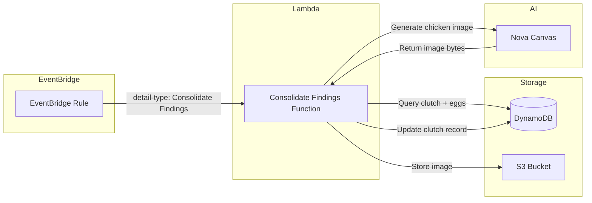

# Clutch Findings Consolidation Design

## Overview

The clutch findings consolidation feature is the final phase of the egg analysis pipeline. When all eggs in a clutch have been analyzed, an EventBridge event triggers consolidation. The system queries all egg data, calculates aggregate statistics, and generates a photorealistic image of the predicted adult chickens using Amazon Nova Canvas.

## Architecture



## Components and Interfaces

### EventBridge Rule

**Rule Pattern:**
```json
{
  "detail-type": ["Consolidate Findings"],
  "source": ["chicken-counter"]
}
```

**Event Structure:**
```json
{
  "version": "0",
  "id": "event-id",
  "detail-type": "Consolidate Findings",
  "source": "chicken-counter",
  "detail": {
    "clutchId": "uuid"
  }
}
```

### Lambda Function: ConsolidateFindingsFunction

**Trigger**: EventBridge rule matching "Consolidate Findings"

**Process Flow:**
1. Extract clutchId from event detail
2. Query DynamoDB for clutch metadata and all eggs (single query)
3. Calculate total egg count and viable egg count (hatchLikelihood >= 50)
4. If viable eggs exist, generate chicken image via Nova Canvas
5. Store image in S3
6. Update clutch record with findings summary

**Input (EventBridge Event):**
```typescript
interface ConsolidateFindingsEvent {
  detail: {
    clutchId: string;
  };
}
```

**Output (Updated Clutch Record):**
```typescript
interface ConsolidatedClutch {
  pk: string;
  sk: string;
  id: string;
  uploadTimestamp: string;
  imageKey: string;
  totalEggCount: number;
  viableEggCount: number;
  chickenImageKey: string | null;
  consolidatedAt: string;
}
```

### Nova Canvas Integration

**Model ID**: `amazon.nova-canvas-v1:0`

**Prompt Template:**
```
A photorealistic photograph of {viableCount} adult chickens standing together in a sunny farmyard.
The chickens are:
{chickenDescriptions}
High quality, natural lighting, detailed feathers, professional photography style.
```

**Chicken Description Format:**
```
- Chicken {n}: {plumageColor} plumage, {combType} comb, {bodyType} body, {featherPattern} pattern, {legColor} legs ({predictedBreed})
```

## Data Models

### Clutch Record (Updated)

```typescript
interface ClutchRecord {
  pk: string;              // "CLUTCH#{clutchId}"
  sk: string;              // "METADATA"
  id: string;              // clutchId (UUID)
  uploadTimestamp: string;
  imageKey: string;        // Original egg image
  createdAt: string;
  GSI1PK: string;          // "CLUTCHES"
  GSI1SK: string;          // uploadTimestamp
  // New fields after consolidation
  totalEggCount?: number;
  viableEggCount?: number;
  chickenImageKey?: string | null;
  consolidatedAt?: string;
}
```

### Egg Record (Reference)

```typescript
interface EggRecord {
  pk: string;              // "CLUTCH#{clutchId}"
  sk: string;              // "EGG#{eggId}"
  id: string;
  clutchId: string;
  hatchLikelihood: number;
  possibleHenBreeds: string[];
  predictedChickBreed: string;
  breedConfidence: string;
  chickenAppearance: {
    plumageColor: string;
    combType: string;
    bodyType: string;
    featherPattern: string;
    legColor: string;
  };
  notes: string;
  analysisTimestamp: string;
}
```

## Correctness Properties

*A property is a characteristic or behavior that should hold true across all valid executions of a system-essentially, a formal statement about what the system should do. Properties serve as the bridge between human-readable specifications and machine-verifiable correctness guarantees.*

### Property 1: Total egg count accuracy
*For any* clutch with N egg records in DynamoDB, the calculated totalEggCount SHALL equal N.
**Validates: Requirements 1.3**

### Property 2: Viable egg count accuracy
*For any* set of eggs with hatch likelihoods [h1, h2, ..., hN], the viableEggCount SHALL equal the count of eggs where hi >= 50.
**Validates: Requirements 2.1**

### Property 3: Consolidation record completeness
*For any* successful consolidation, the updated clutch record SHALL contain totalEggCount, viableEggCount, and consolidatedAt fields.
**Validates: Requirements 2.2, 2.3**

### Property 4: Image prompt chicken count
*For any* clutch with V viable eggs where V > 0, the Nova Canvas prompt SHALL specify exactly V chickens.
**Validates: Requirements 3.2**

### Property 5: Image prompt appearance inclusion
*For any* viable egg in a clutch, the Nova Canvas prompt SHALL include that egg's chickenAppearance data (plumageColor, combType, bodyType, featherPattern, legColor).
**Validates: Requirements 3.3**

### Property 6: Event clutchId extraction
*For any* valid EventBridge event with detail.clutchId, the system SHALL correctly extract and use that clutchId for querying.
**Validates: Requirements 4.2**

## Error Handling

| Scenario | Action | Logging |
|----------|--------|---------|
| Missing clutchId in event | Terminate processing | Error: "Missing clutchId in event detail" |
| Clutch not found | Terminate processing | Error: "Clutch not found: {clutchId}" |
| No eggs in clutch | Complete with zero counts | Info: "No eggs found for clutch" |
| Nova Canvas failure | Store null chickenImageKey | Error: "Image generation failed: {error}" |
| S3 upload failure | Store null chickenImageKey | Error: "S3 upload failed: {error}" |
| DynamoDB update failure | Throw error (retry) | Error: "Failed to update clutch: {error}" |

## Testing Strategy

### Property-Based Testing
- **Library**: fast-check (JavaScript property-based testing library)
- **Minimum iterations**: 100 per property test
- **Tag format**: `**Feature: clutch-findings-consolidation, Property {number}: {property_text}**`

Property tests will verify:
1. Total egg count calculation matches array length
2. Viable egg count correctly filters by hatchLikelihood >= 50
3. Consolidation updates include all required fields
4. Image prompt contains correct chicken count
5. Image prompt includes all viable egg appearance data
6. ClutchId extraction from events works correctly

### Unit Tests
Unit tests will cover:
- Edge case: Empty clutch (0 eggs) returns zero counts
- Edge case: All eggs non-viable (hatchLikelihood < 50) skips image generation
- Edge case: Missing clutchId in event throws error
- Nova Canvas prompt generation format
- S3 key generation for chicken images

