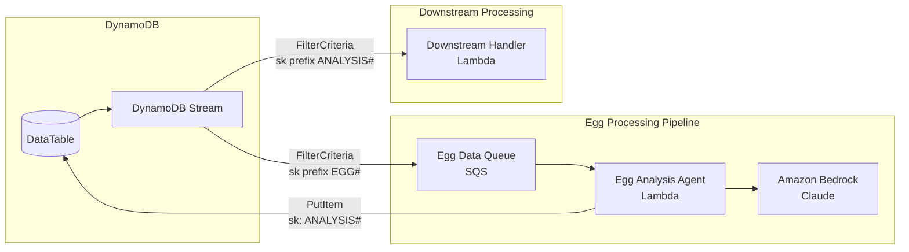

# Design Document: Egg Analysis Agent

## Overview

The Egg Analysis Agent is an event-driven serverless system that processes egg data to predict chicken breeds and hatch likelihood using Amazon Bedrock AI. The system follows a DynamoDB Streams → SQS → Lambda → DynamoDB pattern with filtered event routing to ensure proper separation of concerns between egg data ingestion and analysis result processing.

The architecture prioritizes:
- Sequential processing via SQS to Lambda
- AI-powered analysis using Amazon Bedrock for breed prediction and hatch likelihood
- Event filtering using DynamoDB stream FilterCriteria to route events to appropriate handlers
- Heavy emphasis on hatch likelihood as the primary output metric

## Architecture



## Components and Interfaces

### 1. DynamoDB Table (DataTable)

The existing DataTable with streams enabled for NEW_AND_OLD_IMAGES.

**Egg Record Schema (aligned with #[[file:.kiro/steering/egg-data-schema.md]]):**
| Attribute | Type | Description |
|-----------|------|-------------|
| pk | String | Partition key (e.g., "BATCH#2024-01-15") |
| sk | String | Sort key - "EGG#{eggId}" for eggs, "ANALYSIS#{eggId}" for results |
| color | String | Shell color (white, brown, cream, blue, green, olive, etc.) |
| shape | String | Shape (oval, round, elongated, pointed, asymmetric) |
| size | String | Size (peewee, small, medium, large, extra-large, jumbo) |
| shellTexture | String | Texture (smooth, rough, porous, bumpy, wrinkled, ridged) |
| shellIntegrity | String | Integrity (intact, hairline crack, cracked, chipped, broken) |
| hardness | String | Hardness (hard, normal, soft, thin, rubbery) |
| spotsMarkings | String | Spots/markings (none, light speckles, heavy speckles, calcium deposits) |
| bloomCondition | String | Bloom (present, partial, absent, washed off) |
| cleanliness | String | Cleanliness (clean, slightly dirty, dirty, debris attached) |
| visibleDefects | List | Array of defects (blood spot, meat spot, double yolk indicator, etc.) |
| overallGrade | String | Grade (A, B, C, non-viable) |

**Analysis Result Additional Fields:**
| Attribute | Type | Description |
|-----------|------|-------------|
| possibleBreeds | List | Array of predicted breed names (Rhode Island Red, Leghorn, etc.) |
| breedConfidence | String | Confidence level (high, medium, low, uncertain) |
| hatchLikelihood | Number | Hatch probability 0-100 |
| chickenAppearance | Map | Predicted chicken appearance (plumageColor, combType, bodyType, featherPattern, legColor) |
| notes | String | Free-form LLM observations |
| analysisTimestamp | String | ISO timestamp of analysis |
| eggId | String | Reference to original egg record |

### 2. Egg Data Queue (SQS)

Standard SQS queue receiving filtered DynamoDB stream events.

**Configuration:**
- Queue Type: Standard
- Visibility Timeout: 60 seconds (2x Lambda timeout)
- Message Retention: 4 days
- Receives messages from DynamoDB stream via EventBridge Pipes or Lambda forwarder

### 3. Egg Analysis Agent (Lambda)

Node.js Lambda function that processes egg data and invokes Bedrock.

**Interface (aligned with #[[file:.kiro/steering/egg-data-schema.md]]):**
```typescript
interface EggRecord {
  pk: string;
  sk: string;  // "EGG#{eggId}"
  // Visual Characteristics
  color: string;
  shape: string;
  size: string;
  // Shell Condition
  shellTexture: string;
  shellIntegrity: string;
  hardness: string;
  // Surface Details
  spotsMarkings: string;
  bloomCondition: string;
  cleanliness: string;
  // Viability Assessment
  visibleDefects: string[];
  overallGrade: string;
}

interface ChickenAppearance {
  plumageColor: string;
  combType: string;
  bodyType: string;
  featherPattern: string;
  legColor: string;
}

interface AnalysisResult {
  pk: string;
  sk: string;  // "ANALYSIS#{eggId}"
  eggId: string;
  // Breed Inference
  possibleBreeds: string[];
  breedConfidence: string;  // "high", "medium", "low", "uncertain"
  // Viability
  hatchLikelihood: number;  // 0-100
  // Chicken Appearance Hints
  chickenAppearance: ChickenAppearance;
  // LLM Notes
  notes: string;
  analysisTimestamp: string;
  // Original egg data preserved
  color: string;
  shape: string;
  size: string;
  shellTexture: string;
  shellIntegrity: string;
  hardness: string;
  spotsMarkings: string;
  bloomCondition: string;
  cleanliness: string;
  visibleDefects: string[];
  overallGrade: string;
}
```

**Configuration:**
- Runtime: nodejs22.x
- Timeout: 30 seconds
- Memory: 512 MB

### 4. Bedrock Integration

Uses Amazon Bedrock with Claude model for AI analysis.

**Prompt Structure:**
```
You are an expert poultry scientist. Analyze the following egg characteristics and provide:
1. Possible chicken breeds (list up to 3 most likely)
2. Breed confidence level (high, medium, low, or uncertain)
3. Hatch likelihood percentage (0-100)
4. Predicted chicken appearance based on breed

IMPORTANT: Weight hatch likelihood heavily based on:
- Shell integrity (intact = best)
- Shell texture (smooth = better)
- Hardness (normal = optimal)
- Bloom condition (present = best)
- Visible defects (none = best)

Egg Characteristics:
- Color: {color}
- Shape: {shape}
- Size: {size}
- Shell Texture: {shellTexture}
- Shell Integrity: {shellIntegrity}
- Hardness: {hardness}
- Spots/Markings: {spotsMarkings}
- Bloom Condition: {bloomCondition}
- Cleanliness: {cleanliness}
- Visible Defects: {visibleDefects}
- Overall Grade: {overallGrade}

Respond in JSON format:
{
  "possibleBreeds": ["Rhode Island Red", "Plymouth Rock"],
  "breedConfidence": "high",
  "hatchLikelihood": 85,
  "chickenAppearance": {
    "plumageColor": "red-brown",
    "combType": "single",
    "bodyType": "large/heavy",
    "featherPattern": "solid",
    "legColor": "yellow"
  },
  "notes": "Egg characteristics strongly suggest a heritage breed layer."
}
```

### 5. DynamoDB Stream Event Source Mappings

**For Egg Data (to SQS forwarder):**
```yaml
FilterCriteria:
  Filters:
    - Pattern: '{"dynamodb": {"NewImage": {"sk": {"S": [{"prefix": "EGG#"}]}}}}'
```

**For Analysis Results (to downstream handler):**
```yaml
FilterCriteria:
  Filters:
    - Pattern: '{"dynamodb": {"NewImage": {"sk": {"S": [{"prefix": "ANALYSIS#"}]}}}}'
```

## Data Models

### Egg Record (Input)
```json
{
  "pk": "BATCH#2024-01-15",
  "sk": "EGG#egg-001",
  "color": "brown",
  "shape": "oval",
  "size": "large",
  "shellTexture": "smooth",
  "shellIntegrity": "intact",
  "hardness": "normal",
  "spotsMarkings": "light speckles",
  "bloomCondition": "present",
  "cleanliness": "clean",
  "visibleDefects": [],
  "overallGrade": "A"
}
```

### Analysis Result (Output)
```json
{
  "pk": "BATCH#2024-01-15",
  "sk": "ANALYSIS#egg-001",
  "eggId": "egg-001",
  "possibleBreeds": ["Rhode Island Red", "Plymouth Rock", "Orpington"],
  "breedConfidence": "high",
  "hatchLikelihood": 92,
  "chickenAppearance": {
    "plumageColor": "red-brown",
    "combType": "single",
    "bodyType": "large/heavy",
    "featherPattern": "solid",
    "legColor": "yellow"
  },
  "notes": "Excellent shell condition indicates healthy layer. Brown coloring and size consistent with heritage dual-purpose breeds.",
  "analysisTimestamp": "2024-01-15T10:30:00Z",
  "color": "brown",
  "shape": "oval",
  "size": "large",
  "shellTexture": "smooth",
  "shellIntegrity": "intact",
  "hardness": "normal",
  "spotsMarkings": "light speckles",
  "bloomCondition": "present",
  "cleanliness": "clean",
  "visibleDefects": [],
  "overallGrade": "A"
}
```


## Correctness Properties

*A property is a characteristic or behavior that should hold true across all valid executions of a system-essentially, a formal statement about what the system should do. Properties serve as the bridge between human-readable specifications and machine-verifiable correctness guarantees.*

Based on the acceptance criteria analysis, the following properties can be verified through property-based testing:

### Property 1: Egg Record Field Extraction

*For any* valid SQS message containing a DynamoDB stream record with an egg item, the extraction function SHALL return an object containing all 10 egg characteristics (color, shape, size, shellTexture, hardness, spotMarkings, bloomCondition, cleanliness, visibleDefects, overallGrade).

**Validates: Requirements 1.3**

### Property 2: Bedrock Response Breeds Extraction

*For any* valid JSON response from Bedrock containing a possibleBreeds field, the parsing function SHALL extract possibleBreeds as an array of strings.

**Validates: Requirements 2.2**

### Property 3: Hatch Likelihood Bounds Validation

*For any* analysis result, hatchLikelihood SHALL be a number in the range [0, 100] inclusive.

**Validates: Requirements 3.3**

### Property 4: Analysis Result SK Format

*For any* egg record with sk "EGG#{eggId}", the generated analysis result SHALL have sk "ANALYSIS#{eggId}" where eggId is preserved from the original record.

**Validates: Requirements 4.1**

## Error Handling

| Error Scenario | Handling Strategy |
|----------------|-------------------|
| Invalid SQS message format | Log error, delete message from queue to prevent reprocessing |
| Missing egg characteristics | Use default values or skip analysis, log warning |
| Bedrock invocation failure | Retry with exponential backoff (handled by Lambda), DLQ after max retries |
| Invalid Bedrock response JSON | Log error, return default analysis with low confidence |
| DynamoDB write failure | Retry (handled by Lambda), message returns to SQS for reprocessing |
| Numeric values out of bounds | Clamp to valid range [0, 100] |

## Testing Strategy

### Property-Based Testing

The system will use **fast-check** as the property-based testing library for Node.js.

**Configuration:**
- Minimum 100 iterations per property test
- Each test tagged with format: `**Feature: egg-analysis-agent, Property {number}: {property_text}**`

**Test Structure:**

1. **Property 1 Test**: Generate random egg records with all field combinations, verify extraction returns complete objects
2. **Property 2 Test**: Generate random Bedrock-like JSON responses, verify breeds are always extracted as arrays
3. **Property 3 Test**: Generate random analysis results, verify numeric fields are clamped to [0, 100]
4. **Property 4 Test**: Generate random egg IDs, verify sk transformation from "EGG#" to "ANALYSIS#"

### Generators

```typescript
// Egg record generator (aligned with egg-data-schema.md)
const eggRecordArb = fc.record({
  pk: fc.string().map(s => `BATCH#${s}`),
  sk: fc.string().map(s => `EGG#${s}`),
  color: fc.oneof(fc.constant('white'), fc.constant('brown'), fc.constant('cream'), fc.constant('blue'), fc.constant('green'), fc.constant('olive')),
  shape: fc.oneof(fc.constant('oval'), fc.constant('round'), fc.constant('elongated'), fc.constant('pointed'), fc.constant('asymmetric')),
  size: fc.oneof(fc.constant('peewee'), fc.constant('small'), fc.constant('medium'), fc.constant('large'), fc.constant('extra-large'), fc.constant('jumbo')),
  shellTexture: fc.oneof(fc.constant('smooth'), fc.constant('rough'), fc.constant('porous'), fc.constant('bumpy'), fc.constant('wrinkled')),
  shellIntegrity: fc.oneof(fc.constant('intact'), fc.constant('hairline crack'), fc.constant('cracked'), fc.constant('chipped')),
  hardness: fc.oneof(fc.constant('hard'), fc.constant('normal'), fc.constant('soft'), fc.constant('thin')),
  spotsMarkings: fc.oneof(fc.constant('none'), fc.constant('light speckles'), fc.constant('heavy speckles'), fc.constant('calcium deposits')),
  bloomCondition: fc.oneof(fc.constant('present'), fc.constant('partial'), fc.constant('absent'), fc.constant('washed off')),
  cleanliness: fc.oneof(fc.constant('clean'), fc.constant('slightly dirty'), fc.constant('dirty'), fc.constant('debris attached')),
  visibleDefects: fc.array(fc.oneof(fc.constant('blood spot'), fc.constant('meat spot'), fc.constant('double yolk indicator')), { maxLength: 3 }),
  overallGrade: fc.oneof(fc.constant('A'), fc.constant('B'), fc.constant('C'), fc.constant('non-viable'))
});

// Bedrock response generator
const chickenAppearanceArb = fc.record({
  plumageColor: fc.oneof(fc.constant('white'), fc.constant('red-brown'), fc.constant('black'), fc.constant('golden'), fc.constant('buff')),
  combType: fc.oneof(fc.constant('single'), fc.constant('rose'), fc.constant('pea'), fc.constant('walnut')),
  bodyType: fc.oneof(fc.constant('large/heavy'), fc.constant('medium'), fc.constant('small/bantam'), fc.constant('slender')),
  featherPattern: fc.oneof(fc.constant('solid'), fc.constant('laced'), fc.constant('barred'), fc.constant('speckled')),
  legColor: fc.oneof(fc.constant('yellow'), fc.constant('slate'), fc.constant('white'), fc.constant('black'))
});

const bedrockResponseArb = fc.record({
  possibleBreeds: fc.array(fc.oneof(
    fc.constant('Rhode Island Red'), fc.constant('Leghorn'), fc.constant('Plymouth Rock'),
    fc.constant('Ameraucana'), fc.constant('Orpington'), fc.constant('Marans')
  ), { minLength: 1, maxLength: 3 }),
  breedConfidence: fc.oneof(fc.constant('high'), fc.constant('medium'), fc.constant('low'), fc.constant('uncertain')),
  hatchLikelihood: fc.integer({ min: 0, max: 100 }),
  chickenAppearance: chickenAppearanceArb,
  notes: fc.string()
});
```

### Integration Points

- Lambda function tested with mocked SQS events
- Bedrock calls tested with mocked responses
- DynamoDB writes verified through local DynamoDB or mocks
