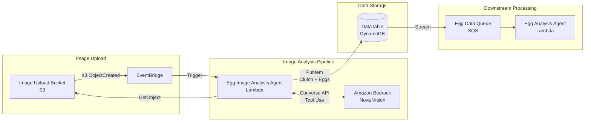

# Design Document: Egg Image Analysis Agent

## Overview

The Egg Image Analysis Agent is an event-driven serverless system that processes egg images uploaded to S3. When an image is uploaded, the agent retrieves it, sends it to Amazon Bedrock's Nova vision model for analysis, and uses tool calling to save individual egg records to DynamoDB. This creates the initial egg data that feeds into the downstream egg-analysis-agent for breed prediction and hatch likelihood calculation.

The architecture prioritizes:
- Event-driven processing via S3 EventBridge notifications
- Vision AI analysis using Amazon Nova models for multimodal image understanding
- Agentic tool use pattern for reliable data persistence
- Compatibility with existing DynamoDB schema (Clutch/Egg key patterns)

## Architecture



## Components and Interfaces

### 1. S3 Image Upload Bucket

The existing ImageUploadBucket with EventBridge notifications enabled.

**Event Payload:**
```json
{
  "version": "0",
  "source": "aws.s3",
  "detail-type": "Object Created",
  "detail": {
    "bucket": { "name": "image-upload-bucket" },
    "object": { "key": "uploads/image-123.jpg", "size": 1024000 }
  }
}
```

### 2. Egg Image Analysis Agent (Lambda)

Node.js Lambda function that processes S3 events and invokes Bedrock.

**Interface:**
```typescript
interface S3EventDetail {
  bucket: { name: string };
  object: { key: string; size: number };
}

interface EggToolInput {
  color: string;
  shape: string;
  size: string;
  shellTexture: string;
  shellIntegrity: string;
  hardness: string;
  spotsMarkings: string;
  bloomCondition: string;
  cleanliness: string;
  visibleDefects: string[];
  overallGrade: string;
  notes: string;
}

interface ClutchRecord {
  pk: string;              // "CLUTCH#{clutchId}"
  sk: string;              // "METADATA"
  id: string;              // clutchId (UUID)
  uploadTimestamp: string; // ISO 8601 timestamp
  imageKey: string;        // S3 object key
  createdAt: string;       // ISO 8601 timestamp
  GSI1PK: string;          // "CLUTCHES"
  GSI1SK: string;          // uploadTimestamp (for sorting)
}

interface EggRecord {
  pk: string;              // "CLUTCH#{clutchId}"
  sk: string;              // "EGG#{eggId}"
  id: string;              // eggId (UUID)
  clutchId: string;        // Parent clutch ID
  color: string;
  shape: string;
  size: string;
  shellTexture: string;
  shellIntegrity: string;
  hardness: string;
  spotsMarkings: string;
  bloomCondition: string;
  cleanliness: string;
  visibleDefects: string[];
  overallGrade: string;
  notes: string;
  createdAt: string;
}
```

**Configuration:**
- Runtime: nodejs22.x
- Timeout: 60 seconds (vision analysis can take time)
- Memory: 512 MB

### 3. Bedrock Integration (Amazon Nova)

Uses Amazon Bedrock Converse API with Nova vision model and tool use.

**Model:** `amazon.nova-pro-v1:0` (supports vision + tool use)

**Tool Definition:**
```json
{
  "toolSpec": {
    "name": "store_egg_data",
    "description": "Save the analysis results for a single egg to the database. Call this tool once for EACH egg you identify in the image.",
    "inputSchema": {
      "json": {
        "type": "object",
        "properties": {
          "color": {
            "type": "string",
            "description": "Shell color (white, cream, brown, dark brown, blue, green, olive, speckled)"
          },
          "shape": {
            "type": "string",
            "description": "Egg shape (oval, round, elongated, pointed, asymmetric)"
          },
          "size": {
            "type": "string",
            "description": "Relative size (small, medium, large, extra-large, jumbo)"
          },
          "shellTexture": {
            "type": "string",
            "description": "Surface texture (smooth, rough, porous, bumpy, wrinkled, ridged)"
          },
          "shellIntegrity": {
            "type": "string",
            "description": "Shell condition (intact, hairline crack, cracked, chipped, broken)"
          },
          "hardness": {
            "type": "string",
            "description": "Shell hardness estimate (hard, normal, soft, thin)"
          },
          "spotsMarkings": {
            "type": "string",
            "description": "Surface markings (none, light speckles, heavy speckles, calcium deposits)"
          },
          "bloomCondition": {
            "type": "string",
            "description": "Protective coating status (present, partial, absent)"
          },
          "cleanliness": {
            "type": "string",
            "description": "Cleanliness level (clean, slightly dirty, dirty, debris attached)"
          },
          "visibleDefects": {
            "type": "array",
            "items": { "type": "string" },
            "description": "Array of visible defects (blood spot, meat spot, double yolk indicator, etc.)"
          },
          "overallGrade": {
            "type": "string",
            "description": "Quality grade (A, B, C, non-viable)"
          },
          "notes": {
            "type": "string",
            "description": "Additional observations about this specific egg"
          }
        },
        "required": ["color", "shape", "size", "shellTexture", "shellIntegrity", "hardness", "spotsMarkings", "bloomCondition", "cleanliness", "visibleDefects", "overallGrade", "notes"]
      }
    }
  }
}
```

**System Prompt:**
```
You are an expert poultry scientist analyzing an image of eggs. Your task is to:

1. Identify ALL eggs visible in the image
2. For EACH egg, assess its quality characteristics
3. Call the store_egg_data tool ONCE for EACH egg you identify

Quality dimensions to assess for each egg:
- color: Shell color (white, cream, brown, dark brown, blue, green, olive, speckled)
- shape: Overall shape (oval, round, elongated, pointed, asymmetric)
- size: Relative size (small, medium, large, extra-large, jumbo)
- shellTexture: Surface texture (smooth, rough, porous, bumpy, wrinkled, ridged)
- shellIntegrity: Structural condition (intact, hairline crack, cracked, chipped, broken)
- hardness: Estimated hardness based on appearance (hard, normal, soft, thin)
- spotsMarkings: Surface markings (none, light speckles, heavy speckles, calcium deposits)
- bloomCondition: Protective coating (present=matte, partial, absent=shiny)
- cleanliness: How clean (clean, slightly dirty, dirty, debris attached)
- visibleDefects: Array of any defects visible
- overallGrade: Quality grade (A=excellent, B=good, C=acceptable, non-viable)
- notes: Brief observations about this specific egg

IMPORTANT: Call store_egg_data for EVERY egg in the image, even if they look similar.
```

### 4. Agent Loop Pattern

The Lambda implements an agentic loop to handle multiple tool calls:

```
1. Send image + prompt to Bedrock Converse API
2. While response.stopReason === 'tool_use':
   a. For each toolUse block in response:
      - Execute store_egg_data tool (save to DynamoDB)
      - Collect tool results
   b. Send tool results back to Bedrock
3. Return when stopReason === 'end_turn'
```

## Data Models

### Clutch Metadata Record
```json
{
  "pk": "CLUTCH#550e8400-e29b-41d4-a716-446655440000",
  "sk": "METADATA",
  "id": "550e8400-e29b-41d4-a716-446655440000",
  "uploadTimestamp": "2024-01-15T10:30:00Z",
  "imageKey": "uploads/clutch-image-123.jpg",
  "createdAt": "2024-01-15T10:30:00Z",
  "GSI1PK": "CLUTCHES",
  "GSI1SK": "2024-01-15T10:30:00Z"
}
```

### Egg Record (from tool call)
```json
{
  "pk": "CLUTCH#550e8400-e29b-41d4-a716-446655440000",
  "sk": "EGG#660e8400-e29b-41d4-a716-446655440001",
  "id": "660e8400-e29b-41d4-a716-446655440001",
  "clutchId": "550e8400-e29b-41d4-a716-446655440000",
  "color": "brown",
  "shape": "oval",
  "size": "large",
  "shellTexture": "smooth",
  "shellIntegrity": "intact",
  "hardness": "normal",
  "spotsMarkings": "light speckles",
  "bloomCondition": "present",
  "cleanliness": "clean",
  "visibleDefects": [],
  "overallGrade": "A",
  "notes": "Healthy looking egg with good shell quality",
  "createdAt": "2024-01-15T10:30:05Z"
}
```

## Correctness Properties

*A property is a characteristic or behavior that should hold true across all valid executions of a system-essentially, a formal statement about what the system should do. Properties serve as the bridge between human-readable specifications and machine-verifiable correctness guarantees.*

### Property 1: S3 Key Extraction
*For any* valid EventBridge S3 event payload, the extraction function SHALL return the correct bucket name and object key from the event detail.
**Validates: Requirements 1.2**

### Property 2: Base64 Encoding Round-Trip
*For any* binary image data, encoding to base64 and decoding back SHALL produce the original binary data.
**Validates: Requirements 1.3**

### Property 3: Tool Execution Creates Valid Egg Records
*For any* valid tool input containing egg characteristics, executing the store_egg_data tool SHALL create a DynamoDB record with all required fields from the egg-data-schema.
**Validates: Requirements 3.3, 4.3**

### Property 4: Clutch Key Structure
*For any* clutchId (UUID), the clutch metadata record SHALL have pk equal to "CLUTCH#{clutchId}" and sk equal to "METADATA".
**Validates: Requirements 4.1**

### Property 5: Egg Key Structure
*For any* clutchId and eggId (UUIDs), the egg record SHALL have pk equal to "CLUTCH#{clutchId}" and sk equal to "EGG#{eggId}".
**Validates: Requirements 4.2**

### Property 6: Clutch GSI Keys
*For any* clutch metadata record, GSI1PK SHALL equal "CLUTCHES" and GSI1SK SHALL be a valid ISO 8601 timestamp.
**Validates: Requirements 4.4**

## Error Handling

| Error Scenario | Handling Strategy |
|----------------|-------------------|
| S3 GetObject failure | Log error, return failure (EventBridge will retry) |
| Image too large for Bedrock | Log warning, skip processing |
| Bedrock invocation failure | Retry with exponential backoff, log error after max retries |
| Invalid tool input from Bedrock | Log warning, use default values where possible |
| DynamoDB write failure | Retry (Lambda handles), log error |
| No eggs detected in image | Log info, create clutch with zero eggs |

## Testing Strategy

### Property-Based Testing

The system will use **fast-check** as the property-based testing library for Node.js.

**Configuration:**
- Minimum 100 iterations per property test
- Each test tagged with format: `**Feature: egg-image-analysis-agent, Property {number}: {property_text}**`

**Generators:**
```typescript
import * as fc from 'fast-check';

// UUID generator
const uuidArb = fc.uuid();

// S3 event generator
const s3EventArb = fc.record({
  detail: fc.record({
    bucket: fc.record({ name: fc.string({ minLength: 3, maxLength: 63 }) }),
    object: fc.record({
      key: fc.string({ minLength: 1 }).map(s => `uploads/${s}.jpg`),
      size: fc.integer({ min: 1, max: 10000000 })
    })
  })
});

// Tool input generator (aligned with egg-data-schema)
const toolInputArb = fc.record({
  color: fc.constantFrom('white', 'cream', 'brown', 'dark brown', 'blue', 'green', 'olive', 'speckled'),
  shape: fc.constantFrom('oval', 'round', 'elongated', 'pointed', 'asymmetric'),
  size: fc.constantFrom('small', 'medium', 'large', 'extra-large', 'jumbo'),
  shellTexture: fc.constantFrom('smooth', 'rough', 'porous', 'bumpy', 'wrinkled', 'ridged'),
  shellIntegrity: fc.constantFrom('intact', 'hairline crack', 'cracked', 'chipped', 'broken'),
  hardness: fc.constantFrom('hard', 'normal', 'soft', 'thin'),
  spotsMarkings: fc.constantFrom('none', 'light speckles', 'heavy speckles', 'calcium deposits'),
  bloomCondition: fc.constantFrom('present', 'partial', 'absent'),
  cleanliness: fc.constantFrom('clean', 'slightly dirty', 'dirty', 'debris attached'),
  visibleDefects: fc.array(fc.constantFrom('blood spot', 'meat spot', 'double yolk indicator'), { maxLength: 3 }),
  overallGrade: fc.constantFrom('A', 'B', 'C', 'non-viable'),
  notes: fc.string({ maxLength: 200 })
});
```
